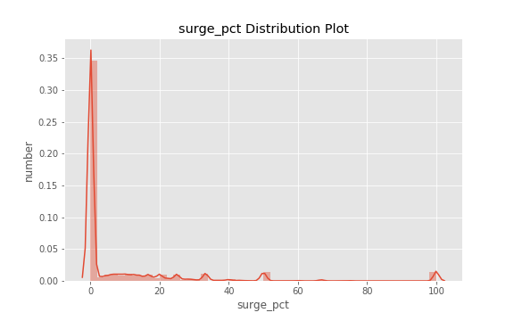
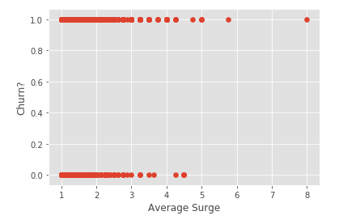

## Battle of the Churns

Can we predict a user will 'churn' better than you?

### Contributors
|  [Cindy Wong](https://github.com/cwong690)  |
 [Tyler Woods](https://github.com/tylerjwoods)  |
 [Nathan Rasmussen](https://github.com/rasbot)  |
   
---

**Main Goal:**  
Predict if a ride-share user will churn (that is, not be active within the past 30 days).  

*Note: This info is sourced from a ride-sharing company (Company X) and is interested in predicting rider retention*

**Evaluation:** 
The evaluation of our model will be based on Accuracy, Recall, and Precision. 

Where,
TP = True Positive
TN = True Negative  
FP = False Positive
FN = False Negative

**Deliverables:** 

How did we compute the target?  

The data was taken on July 1, 2014. If a user has not taken a ride in the past 30 days (since June 1, 2014), we consider that user as "churn". We used a pandas dataframe to make a new column called 'churn', where the value 1 is if that user has churned.

Using this computation, we found that there were about 62% of the sample data that were considered "churn".

We started with some classic exploratory data analysis. We examined the distribution plots of some numerical columns.

What model did you use in the end? Why?  

We used a Voting Classifier. All of our models were found to have not-so-great accuracies, so we combined them in a voting classifier to try to increase our scores.

For the Voting Classifier, on the final testing set:

ROC curve and area under curve:

Alternative models you considered? Why are they not good enough?  

Considered a Random Forest Classifier and using a 10 K-Fold split with the training data:

The Random Forest ROC Curve was plotted and ROC area under curve was found. The ROC Score was found to be 0.711.

Considered a Logistic Regression Classifier and using a 3 K-Fold split with the training data:

Not great.

Considered a Bagging Classifier and using a 3 K-Fold split with the training data:

Also considered a gradient boosting classifier. The gradient boosting classifier performed poorly when compared to the random forest classifier. Using gridsearch, more optimal hyperparameters were found, but this method is CPU intensive and time consuming. Looking at the MSE for two different learning rates for the testing and training data as function of the number of decision trees, it is clear that a learning rate of 0.08 performed better than 0.02:

And comparing this to the random forest classifier, it appears that the MSE is slightly better.

Compared to the bagging classifier, the accuracy is the same,but precision went up a bit and recall went down slightly.

Based on insights from the model, what plans do you propose to reduce churn?

Using feature importance of the random forest model, we found the following feature importances:

It appears that Average Rating by Driver, Average Surge, and Surge Percentage have the most importance. 

Diving into Average Surge, it appears that if the user had a higher average surge, then they were more likely to churn.

The most obvious way to limit the amount of churning: STOP SURGING!!!
Also, could limit surges on people; i.e., if a user is continually being surged, give them a break here and there.

What are the potential impacts of implementing these plans or decisions? 

If you implement limiting surging on specific individuals, you're obviously going to be generating less money.

Future Work:

Drop some of very unimportant columns that we find

Do some feature engineering and look into linear regression

Dive into more of the reprussions of precision, accuracy, and recall for this problem.

Clean up files within project.